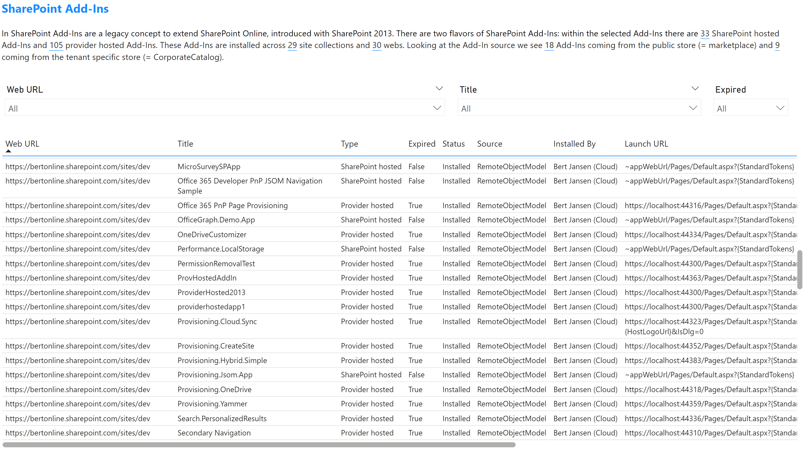

# SharePoint Add-In overview

Using this report page you'll be able to list all the discovered SharePoint Add-Ins, SharePoint Add-Ins are a legacy extensibility method enabling you to build SharePoint Hosted Ad-Ins (hosted in an app web in SharePoint) and Provider Hosted Add-Ins (hosted by a service provider) which depend on Azure ACS to communicate with SharePoint. Use the table on this report page to get an overview, apply the filters to scope your overview when needed. In the shown table these columns are presented:

Column name | Description
------------|------------
Web URL | The fully qualified URL of the web where the SharePoint Add-In was installed
Title | The title of the SharePOint Add-In
Type | Is this a SharePoint Hosted, Provider Hosted or Hybrid Add-In. The latter category is when an Add-In is both (having an app web and an ACS principal)
Expired | For SharePoint Hosted Add-Ins this value is always false, for Provider Hosted Add-Ins that are not coming from the marketplace we do know the expiration date of the linked Azure ACS principal and this field can be set to true
Status | Typically a SharePoint Add-In is status `Installed`, but additional statuses are possible
Source | From which source was the SharePoint Add-In installed, common sources are `Marketplace`, `CorporateCatalog` (= tenant app catalog) and `RemoteObjectModel` (side-loaded using development tools)
Installed By | Who installed the SharePoint Add-In
Launch URL | What URL is called when the SharePoint Add-In is launched
Asset Id | If the SharePoint Add-In was installed from the marketplace then this column contains the related marketplace asset id
Product Id | Id of the SharePoint Add-In

## Sample page

