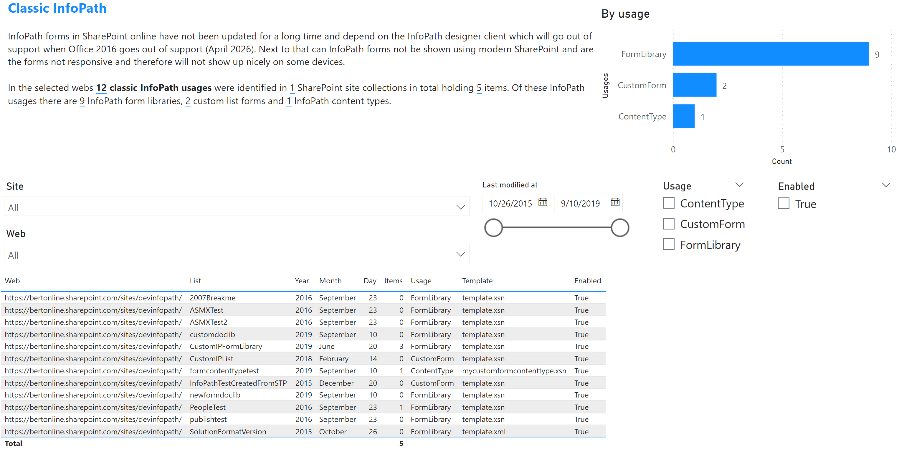

# Overview

InfoPath forms in SharePoint online have not been updated for a long time and depend on the InfoPath designer client which will go out of support when Office 2016 goes out of support (April 2026). Next to that can InfoPath forms not be shown using modern SharePoint and are the forms not responsive and therefore will not show up nicely on some devices. In the shown table these columns are presented:

Column name | Description
------------|------------
Web | The fully qualified URL of the web hosting the InfoPath usage
List | The name of the list or form library hosting the InfoPath usage
Year | Year when the last user triggered change for an item in the list/library that uses this InfoPath happened
Month | Month when the last user triggered change for an item in the list/library that uses this InfoPath happened
Day | Day when the last user triggered change for an item in the list/library that uses this InfoPath happened
Items | The amount of items/files in the list or library having InfoPath usage. Lists or form libraries containing zero or a few items are often less important to migrate
Usage | Indicates how InfoPath is used: when `FormLibrary` an InfoPath form is used to collect data which is stored as InfoPath XML in a form library. When `CustomForm` an InfoPath form is used to customize the list forms and finally when `ContentType` the InfoPath form is linked to a content type
Template | The name of the InfoPath form template (the .xsn file being used)
Enabled | Always true in this report

## Sample page

